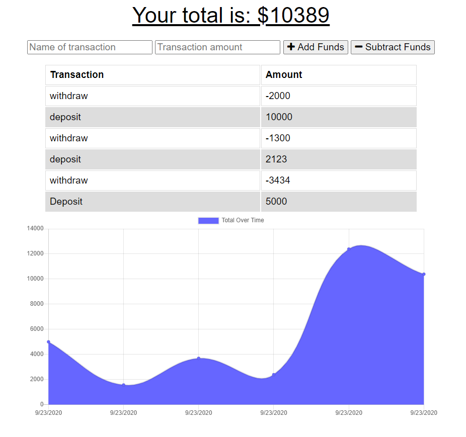

# PWS Budget Tracker

                                 

## Description
Users are able to keep track of withdrawals and deposits on a set budget with or without an internet connection

[Live App](https://peaceful-brook-57472.herokuapp.com/)

## Table of Contents
* [Installation](#Installation-Guide)
* [Usage](#Usage)
* [Contributors](#Contributors)
* [Contact-Information](#contact-Information)

## Installation Guide

        
## Usage
The name of transaction input is for the user to enter a reminder for added or subtracted funds. The transaction amount is for users to input how much money they will be depositing or withdrawing.
        
## Contributors
Jesus Rios

## Contact Information
Github Username - [JesusFernandoRios](http://github.com/JesusFernandoRios)

E-mail - jesusfernandorios@outlook.com
